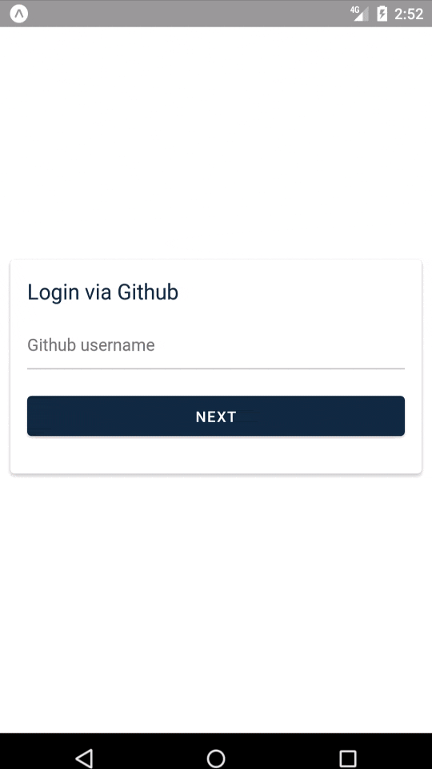
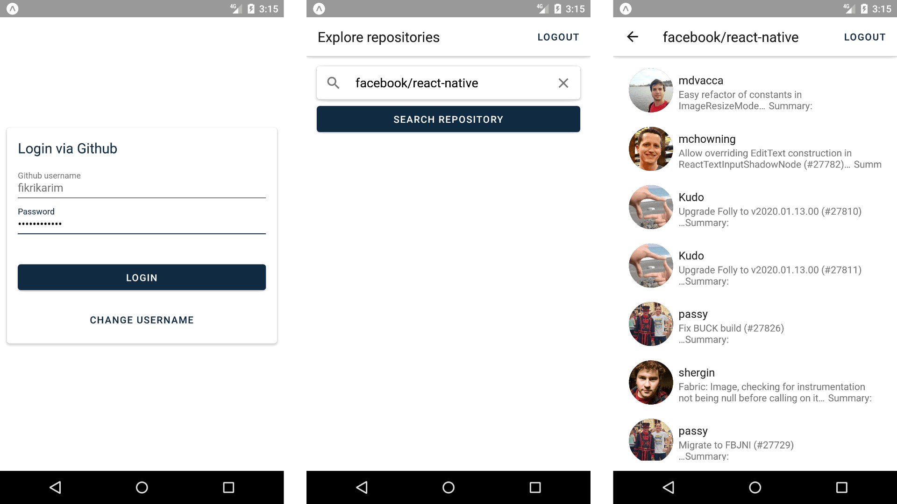
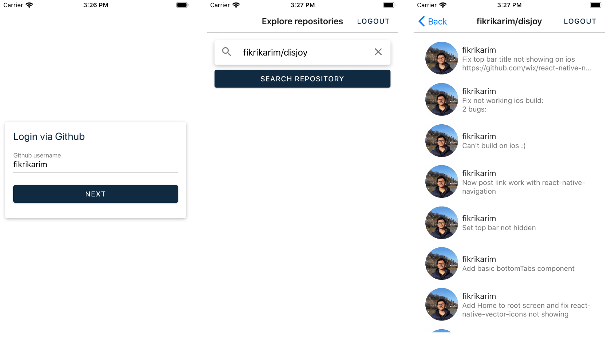
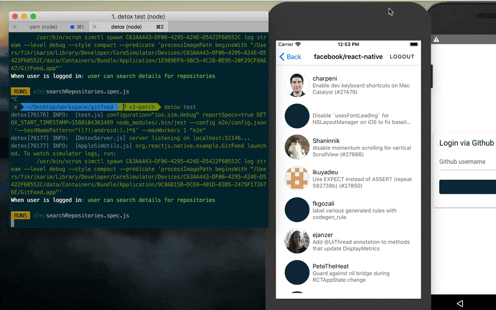

# GitFeed





## Installation

This app use standard react-native instalation.

Follow the [official guide by the react-native team](https://facebook.github.io/react-native/docs/getting-started)

Select the React Native CLI Quickstart

## Testing

End-to-end testing:



[Follow guide by detox for running and installation](https://github.com/wix/Detox/blob/master/docs/Introduction.GettingStarted.md)

Right now the End-to-end testing is only enabled for iOS.

## Troubleshoot

If there's trouble after installing cocoapods, and cannot run on ios:

Remove input files and output paths on project.pbxproj

So it became similar to

```
75944360D524846EA61F4FF8 /* [CP] Copy Pods Resources */ = {
  isa = PBXShellScriptBuildPhase;
  buildActionMask = 2147483647;
  files = (
  );
  inputFileListPaths = (
  );
  inputPaths = (
  );
  name = "[CP] Copy Pods Resources";
  outputFileListPaths = (
  );
  outputPaths = (
  );
  runOnlyForDeploymentPostprocessing = 0;
  shellPath = /bin/sh;
  shellScript = "\"${SRCROOT}/Pods/Target Support Files/Pods-GitFeed/Pods-GitFeed-resources.sh\"\n";
  showEnvVarsInLog = 0;
};
```

This is an ongoing issue with [React-native because of Xcode new build system](https://github.com/facebook/react-native/issues/20492)

## Additional improvements

- Saved credentials on localstorage. No need to sign in after restarting the app.

## Nice-to-have improvements

- Use OAuth instead of username:password auth. Need a server to save the client_secret.
- Animation during login prosess
- Shows onboarding, instead of login form directly.
- Pagination on the commit list, by setting initial `commitSince` and `commitUntil`, and increase it when we reach the end of the list. For example, in the beginning `commitSince = now` and `commitUntil = now - 1 week`. Then when we reach the end of the list, we fetch for `commitSince = now - 1 week`, and `commitUntil = now - 2 week`, and append the data to the list.
- Add splash screen and icon.
- Mock the GitHub API for e2e tests.

## Potential business case

- Give curated feed of the subscribed and popular repositories
- Real time notifications for issues, pull request, or even a star
- Charge monthly subscription or one time purchase.
- Well, Github is building their own [official apps](https://github.com/mobile), so we're going against the tide here.
- One thing, we can integrate with Bitbucket and Gitlab. So GitFeed become the one true app to get latest updates on any repositories across different platforms.

## Timeline and Thought Process

### Tue, Jan 21

16:07 - 16:53

- Start reading and understanding the interview task
- Pretty confused with "login screen where user can enter their Github login" and "password screen where user can enter his Github password and a submit button"
- So do we authenticate the user manually and the user is expected to enter their username and password in our own text field?
- Check if Github API provides authentication using username and password
- Hmm yea they do. Okay no problem with the first and second requirement.
- Finish reading the rest of the interview task. Well I think we can do that.

19:05 - 19:41

- Read the interview task again
- Check the Github API authentication again. Test using curl.
- After testing with cURL. Got this warning on email:
  "You recently used a password to access an endpoint through the GitHub API using curl/7.54.0. We will deprecate basic authentication using password to this endpoint soon:
  https://api.github.com/
  We recommend using a personal access token (PAT)"
- Hmm, yea username and password authentication is not recommended. Normally we do OAuth authentication. Can we use OAuth instead of typing username and password in our app?
- Other than that, if we use username and password plainly and we save it on localstorage, it's a security problem because hacker can acess the saved username and password. If we use OAuth, then it's not a problem because we save access_token not the whole username and password.
- Is it fast to implement the OAuth? Do we need a server for the redirect uri? (I've only built OAuth authentication on server rendered apps, Rails)
- I think Expo provides some OAuth library. Let's check that.
- Hmm yea Expo provides some abstraction for OAuth. Now let's get started.
- When starting new React Native application, the first thing we have to decide is whether to use Expo or not.
- Expo has advantage: lot of abstractions for faster dev time, OTA code update, and easier Android and iOS build
- Expo disadvantages: big app size! My lastest simple RN app was 22 MB using Expo :(, can't use library that need to change native code.
- Because for now our app need lot of abstractions, and there's no requirement that needs native code, so we will use expo yay. Anddd expo will provide a navigation structure using react-navigation, so it would be faster to bootstrap our app.
- Talking about navigation, I prefer react-native-navigation, because it's faster and feels smoother. But for this app I think it's good enough to use react-navigation
- Why no redux? Because this app doesn't need global state, and redux would only create another not really useful abstraction.

19:42 - 20:26

- Let's generate our app. But now we have to decide what we should name our app. Hmm so our app shows the git updates of a repo. GitUpdate maybe? No fun. GitFeed? I like it. Let's search on google to see if there's any project with that name
- Well there's some project but no big one. GitFeed it is!
- Initiate app using expo.
- Move our timeline note from simplenote to readme in the expo and do first commit.
- Well I have ton of ideas how to improve the app. But for now let's keep it simple and release v1 that fulfill all the mandatory requirement.
- First, let's do the switch navigator that checks whether the user is authenticated or not, if not, then redirects user to Sign in page. And while the app is checking, shows loading spinner.
- Let's use hook instead of Class. Because, why not. It's a new project after all.
- Now we make LoginScreen, and MainScreen, and try to make AuthLoadingScreen randomly go to either login screen, before we implement the real logged in checking mechanism, to get sense of the AuthLoadingScreen.

### Wed, Jan 22

03:22 - 04:28

- Okay let's make the SignInScreen to actually try to sign in.
- Even tho yesterday we planned to use OAuth, I think it's more straightforward to use plain username:password authentication for the v1, and see if we can switch to OAuth later if we have time. Hope the username:password authentication doesn't get deprecated during the testing period haha.
- Well we need a UI library. I'll use react-native-paper again as I had good experience with it, compared to NativeBase.
- We also need to start thinking about colors and theme. Let's use some color pallete from Refactoring UI.
- Why do we need to separate the input password into different steps? :(
- Okay no big deal. Maybe in the future we could validate the username first with the Github API first, before going to the password, like the UX of Tokopedia.
- We could add animation during the login flow in the future.
- So for now our auth flow is: user filled username and password; we authenticate to the API; if the credential is valid, save it to localStorage for future use. Well there's security issue with saving password, but that's the requirement for v1.
- In day job I'd communicate the security problem with the PM, tell them about the alternative which is using OAuth (and need server for this), so maybe the specification could change.

04:57 - 05:42

- Let's do the API call and try to authenticate.
- We'll use axios, as it's the library I'm most familiar with. We'll use REST instead of GraphQL too because I'm much more familiar with REST, and so far they do the jobs well.
- Whelp. There's problem on lastest axios version, v0.19.1, when used in [Expo environment](https://github.com/axios/axios/issues/2235). Downgrading to v0.18.0 solves it.

08:02 - 08:47

- Implement the part where the user provides correct credentials
- Add layout of MainNavigator, RepoListScreen, and RepoDetailsScreen

09:19 - 09:58

- Want to continue to finish RepoListScreen and RepoDetailsScreen, but it's PITA if I have to login everytime I refresh the app. So we'll try to save our credential to localStorage, so the user don't need to login whenever they open the app. If the user click the logout, we'll clear the credential from the localStorage, and the user have to login again.
- Add NavigationService to navigate from outside screen or components.

12:03 - 12:33

- Start doing the RepoListScreen and RepoDetailsScreen
- There's searchbar component on react-native-paper. But, I don't really like to place the search button on the left?
- Seems unintuitive if we provide the default value `facebook/reactnative` as the user don't know what to do with the search button? ? What if we instead use a placeholder on the searchbar like "Try facebook/reactnative"?
- Other thing is we can place another button below the search bar. Yea I think it's better as we don't change the requirement.
- Why do we need to separate the Repo details screen and the repo search screen? Usually the searchbar is above the search result..?

13:19 - 14:33

- Completing the RepoDetailsScreen
- Searching for the commits API on Github. It looks like the `GET /repos/:owner/:repo/commits` provides everything we need, except for avatar for each user. Is there any easy way to fetch the avatar?
- Welp, [quick googling](https://stackoverflow.com/questions/22932422) found that you can get the avatar directly by adding `.png` to each user link. For example, to get my avatar you can visit [https://github.com/fikrikarim.png](https://github.com/fikrikarim.png)
- Dang. I spent 5 minutes debuggin a API problem when fetching `GET /repos/facebook/reactnative/commits` and it returns 404. I thought something is wrong with my authentication, and I have to use OAuth or Github Apps to access the API. It turns out, the repo name should be `react-native` instead of `reactnative`
- Now we complete all the requirements. Just need to do the pagination
- Whelp the pagination would be much easier if they use a number, instead of time. Now if we want to do it we need to install moment for managing time. But there's only 1.5 hours left, and we haven't done the test yet.

14:37 - 15:29

- Creating gifs for README
- Oh no. No gifs today. Instead, using screenshots :(

15:29 - 16:00

- Need more time to write good test :(
- Daaaaym I don't have time to write test. Well, there goes my testing score. Please consider to see [my other project that's fully tested](https://github.com/fikrikarim/hnpopquiz/tree/master/src/__tests__) if it's possible.
- Or if you want, I could update this project in the future to have more tests.
- Anyway, I had fun doing this project. Hope for the best, whatever it is ヽ( •\_)ᕗ
